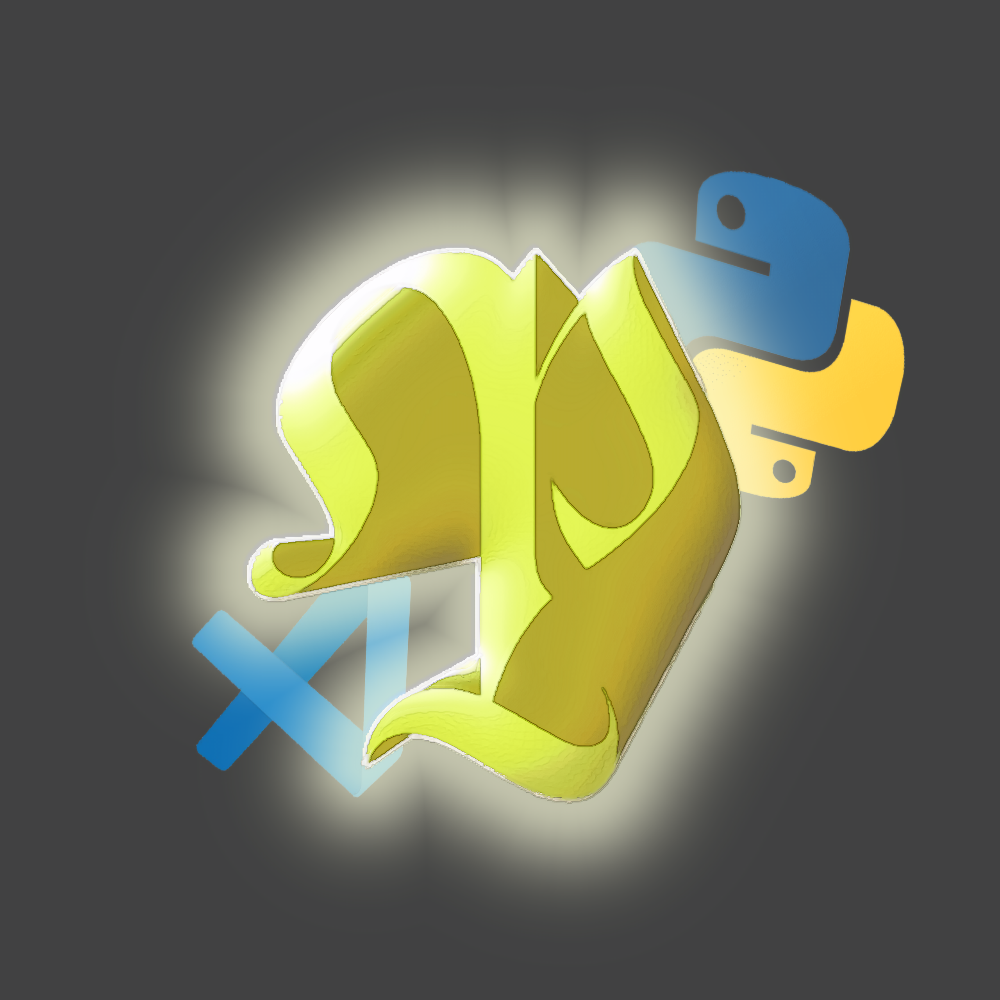

<h3 align="center">⭐ N'oubliez pas d'ajouter une étoile ! ⭐</h3>
<h3 align="center">⭐ Don't forget to star the repository! ⭐</h3>

# 📜 Description:
Made for

  
  
  

👨‍💻 -> Développé en **Python**. 
💻 -> Disponible sur **Windows**,**MacOS**,**Linux**.  
🔎 -> **Sans malware** ni **backdoor**. 
📂 -> **Open Source** et que 2-3 script obf (C'est pour **limité** les reprises des script en question etc !) vous pouvez tester avec virus total etc aucune backdoor. 
🔄 -> **Mises à jour fréquentes**. 
💰 -> **Gratuit** pour tout le monde. 
